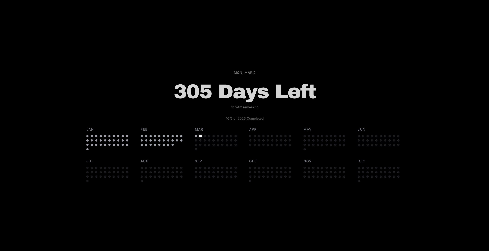

# Solace

Solace is a beautifully designed, minimalist time-tracking dashboard built with React, TypeScript, and Vite. It provides an aesthetic visualization of your year, helping you stay mindful of time passing while maintaining a calming interface.

##  Screenshot



##  Features

- **Daily Countdown:** Highlights the number of days left in the current year.
- **Year Progress Bar:** A sleek visual indicator showing the percentage of the year that has already elapsed.
- **Dot Calendar Visualization:** A grid displaying the entire year at a glance, allowing you to see past, present, and future days represented as subtle dots.
- **Dynamic Date & Time:** Constantly updates to reflect the current date and time left in the current day.
- **Minimalist Aesthetic:** Uses modern typography (Inter and Archivo Black) with a dark mode base for a premium feel.

##  Getting Started

To run Solace locally on your machine, follow these steps:

### Prerequisites

Ensure you have [Node.js](https://nodejs.org/) installed on your machine.

### Installation

1. Clone or download the repository to your local machine.
2. Navigate to the project directory:
   ```bash
   cd Solace
   ```
3. Install the dependencies:
   ```bash
   npm install
   ```

### Running the App

Start the development server:

```bash
npm run dev
```

Open your browser and navigate to `http://localhost:5173` to view the app.

### Building for Production

To create a production-ready build:

```bash
npm run build
```

This will generate a `dist` folder containing the optimized assets.

## 🛠 Technologies Used

- **React 19**
- **TypeScript**
- **Vite**
- **Tailwind CSS 4**

##  Typography

- Primary Font: **Archivo Black**
- Secondary Font: **Inter** / **Raleway**

Enjoy tracking your year with Solace!
