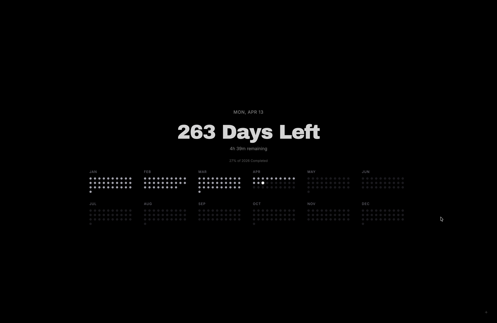

# Solace

> A minimalist, typography-driven new tab extension for time awareness and intentional focus.

Solace transforms your browser's new tab page into a serene, ambient dashboard. By gently visualizing the passage of time—days, months, and the year—it shifts perspective from endless scrolling to mindful productivity.

*(Note: Preview image will be updated soon)*


## Core Features

- **Ambient Time-Tracking**: A refined view of the current year's progression, shifting focus to what matters.
- **Dot Calendar Visualization**: A beautifully rendered grid representing every day of the year at a glance, allowing you to reflect on past days and anticipate the future.
- **Shortcut Dock**: Quick access to your most important links, minimizing friction between opening a tab and getting to work.
- **Minimalist Aesthetic**: Masterfully crafted with modern typography (Archivo Black and Inter) and seamless dark/light mode transitions.
- **Dynamic Adaptability**: Constantly updates in real-time, functioning as both a clock and a subtle yearly countdown.

## Installation (Browser Extension)

To use Solace as your default New Tab experience, you can load it as an "unpacked extension" in any Chromium-based browser (Google Chrome, Microsoft Edge, Brave, etc.).

### Step 1: Get the files
Clone the repository to your local machine, or download the source code as a ZIP file directly from GitHub and extract it.

```bash
git clone https://github.com/your-username/solace.git
cd solace
```

### Step 2: Build the project
Since Solace is built with React and Vite, you need to compile the source code into static files. Make sure you have [Node.js](https://nodejs.org/) installed before proceeding.

```bash
npm install
npm run build
```

This command generates a `dist` folder inside the project directory, which contains the compiled extension ready for your browser.

### Step 3: Add to your browser
1. Open your browser and navigate to `chrome://extensions/` (or `edge://extensions/` for Edge).
2. Turn on **Developer mode** (usually a toggle switch located in the top right corner).
3. Click the **Load unpacked** button.
4. Select the `dist` directory that was generated in Step 2.
5. Open a new tab and experience Solace.

## Local Development

If you would like to customize the dashboard or contribute to the project:

```bash
# Install dependencies
npm install

# Start the development server
npm run dev
```

The app will be available at `http://localhost:5173`. Any changes made during development will automatically reflect in the browser.

## Technologies Used

- **React 19**: Component architecture and state management
- **TypeScript**: Enhanced type safety and predictability
- **Tailwind CSS 4**: Utility-first styling for precise aesthetic control
- **Framer Motion**: Fluid animations and micro-interactions
- **Vite**: High-performance frontend tooling


